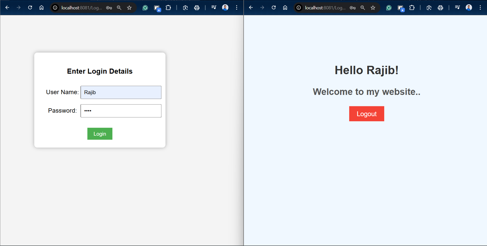
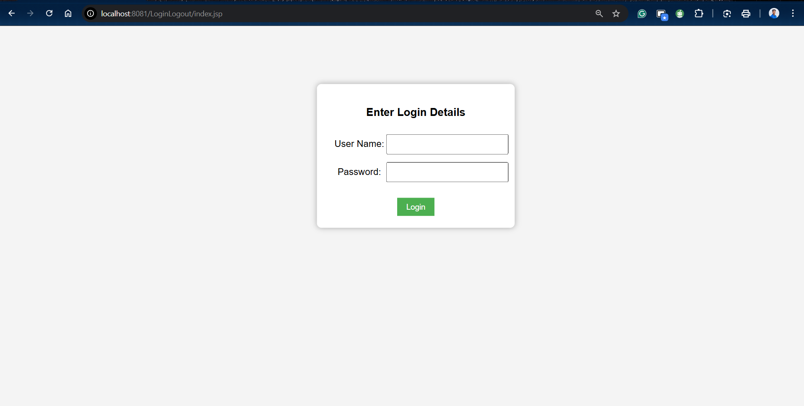

# JSP-Example
## Servlet – HttpSession Login and Logout Example
This project demonstrates a **basic Login and Logout system using Java Servlets and HttpSession**.
It shows how to create, manage, and invalidate user sessions in a Servlet-based web application.

---

## 📌 Project Overview
Managing user sessions is essential in web applications to track user login status across multiple requests.
In this project, **HttpSession** is used to:

* Store user login information
* Restrict access to secured pages
* Destroy session data on logout

---

## 🛠 Technologies Used
* Java (JDK 8+)
* Java Servlets
* JSP
* Apache Tomcat Server
* Eclipse IDE
* HTML

---

## 📂 Project Structure

```
Servlet_LoginLogout
│
├── src
│   ├── LoginServlet.java
│   └── LogoutServlet.java
│
├── WebContent
│   ├── login.jsp
│   ├── welcome.jsp
│   └── WEB-INF
│
└── web.xml
```

---

## ⚙️ Application Flow

1. User opens **login.jsp**
2. Enters username and password
3. **LoginServlet**

   * Validates credentials
   * Creates HttpSession
   * Stores username in session
4. User is redirected to **welcome.jsp**
5. User clicks **Logout**
6. **LogoutServlet**

   * Invalidates session
   * Redirects back to login page

---

## 📸 Screenshots

### 🔐 Login with Welcome Page


## Password wrong then show this 


### 🚪 Logout



---

## ✅ Features

* Session-based authentication
* Secure logout using session invalidation
* Simple and beginner-friendly
* Useful for academic & interview preparation

---

## 📚 Learning Outcome

* Understanding HttpSession lifecycle
* Session creation and destruction
* Login and logout flow using Servlets
* JSP and Servlet interaction

---

## 🧠 Reference

* Oracle Java Servlet Documentation
  [https://docs.oracle.com/javaee/7/api/javax/servlet/http/HttpSession.html](https://docs.oracle.com/javaee/7/api/javax/servlet/http/HttpSession.html)

* Apache Tomcat Documentation
  [https://tomcat.apache.org/](https://tomcat.apache.org/)

---

### ⭐ If you like this project, don’t forget to star the repository!

